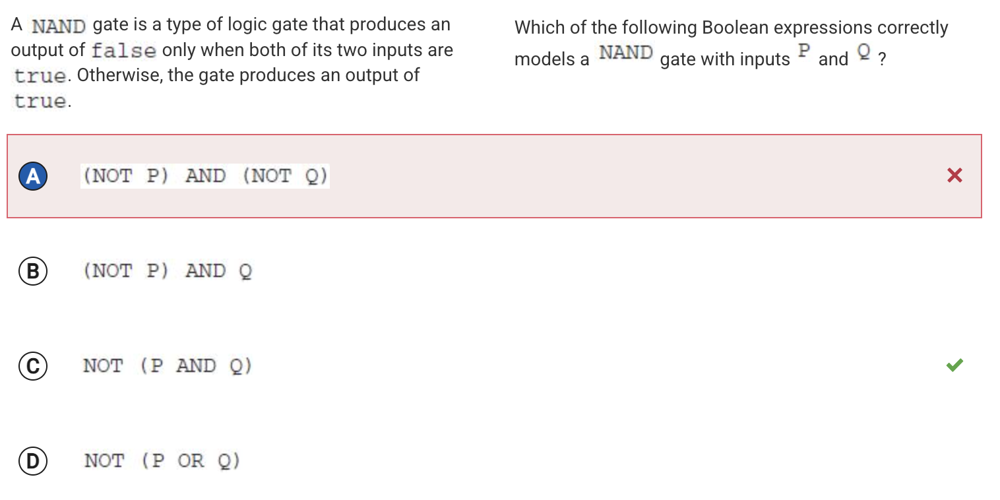
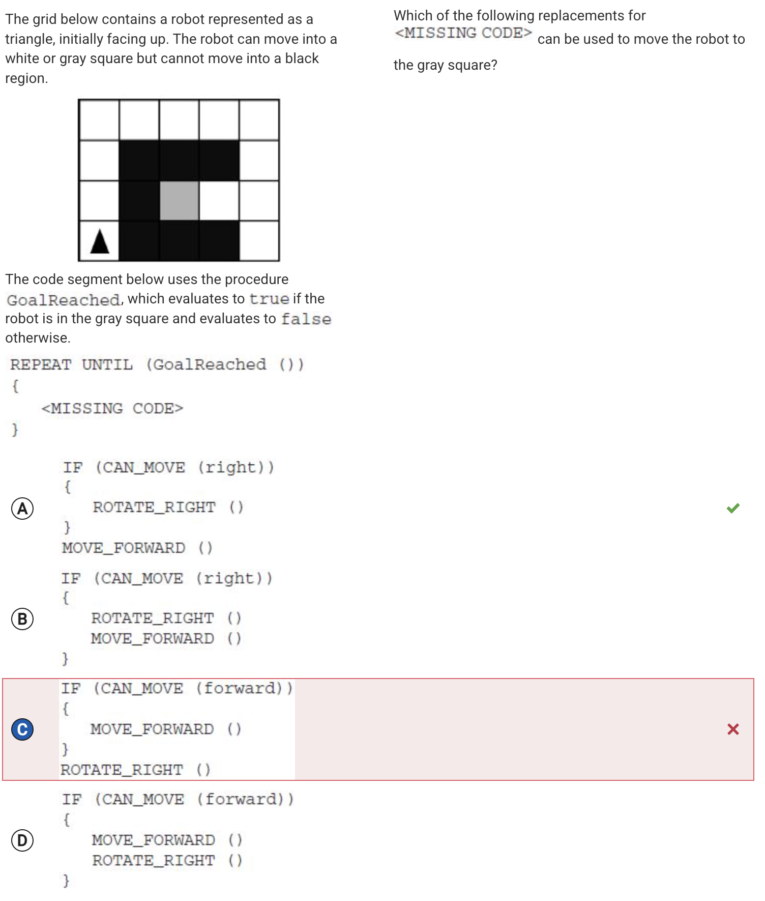
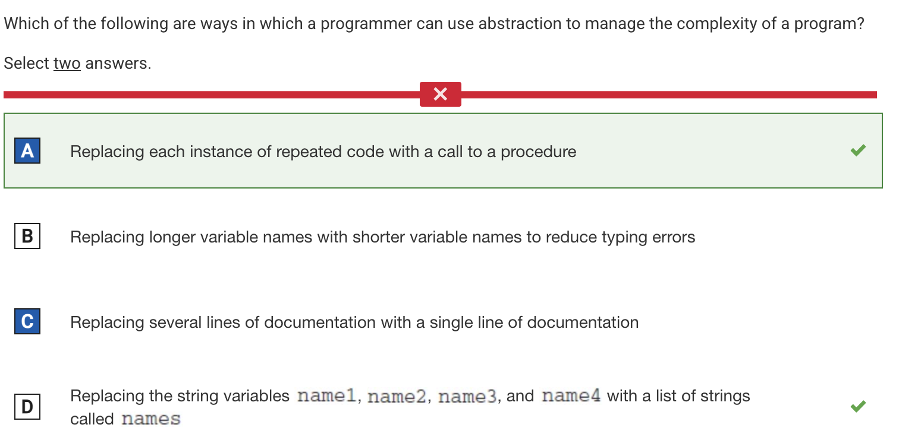
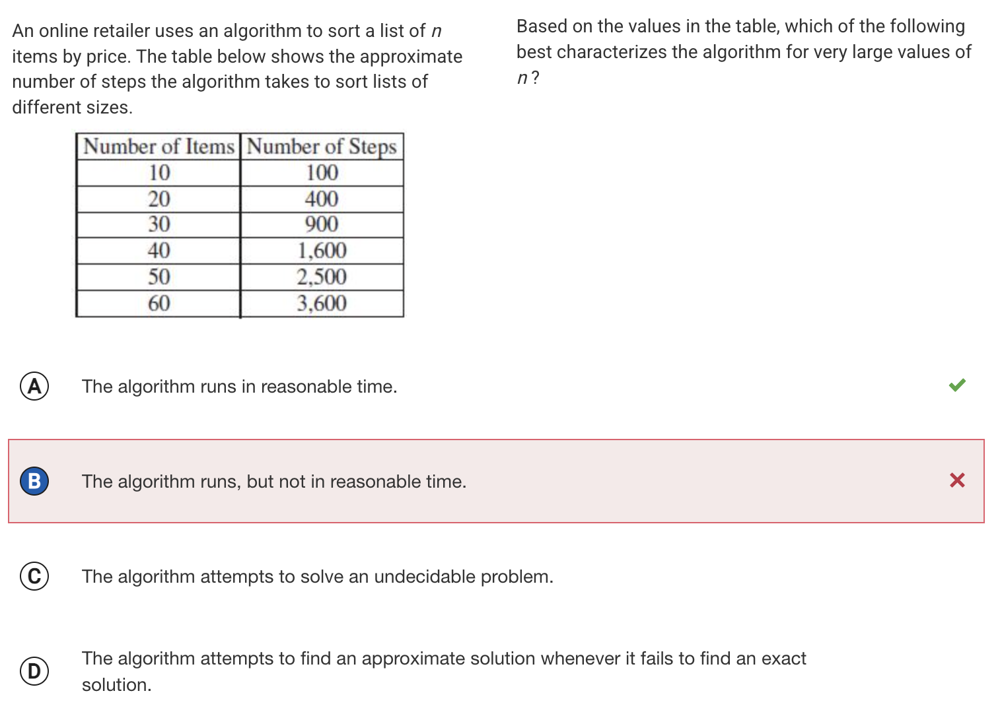
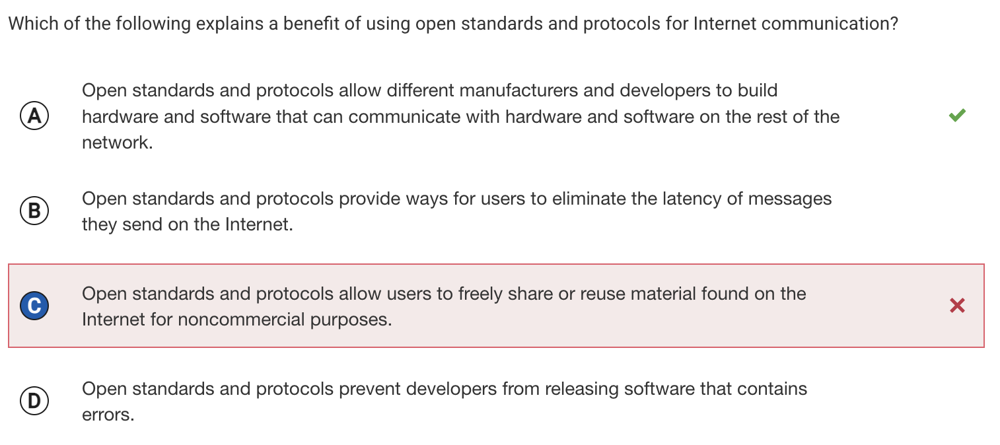
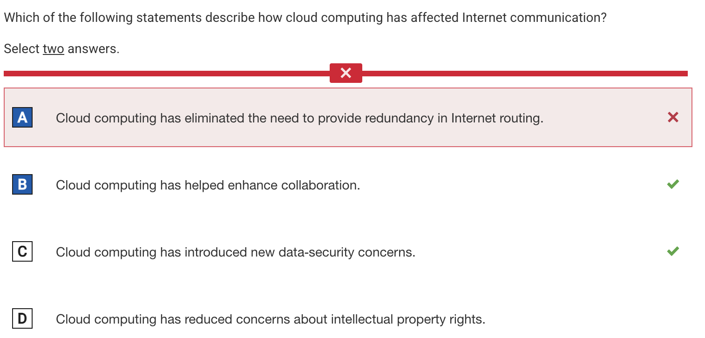
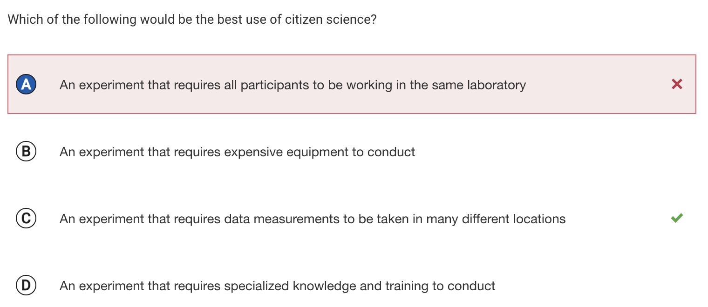
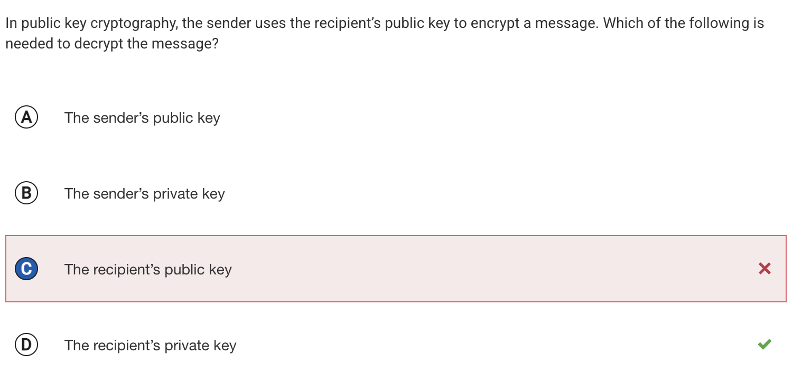

# Self-Reflection
- Better at organizing a team
- Improved communication
- Learned how to accomodate for differences

# Key Moments from Sprints
## Tools
- Helping others with setting up clarified the procedures for me
- Learning how to structure pages through Sci-Fi Tools lesson (quiz-like progression through pages)

## Fundamentals of JS/Python
- Clarified concepts I didn't understand (algorithmic efficiency)
- Sending requests and testing in a Flask server (calling procedures lab)
- Involving all team members in planning and executing the project (whiteboard planning)

## Digital Famine
- Implementing Gemini API and getting it to work
- Going more in depth on the API layers (microblog api)

# N@TM
- Received all positive comments
- Visited CSSE game
    - Cohesive theme and well-integrated levels
    - Interesting storyline, fluid gameplay, seems not buggy
    - Casino level: well-executed game, could be improved by adding a tutorial/instructions on black jack

# Looking Ahead
## Digital Famine 
If given time, I would revise the submodules to be more cohesive with the digital famine concept (adding digital famine storyline in the lesson, adding a figure who narrates according to the digital famine, adding features that relate to other submodules, more cohesive theme for each submodule)

## CS Learning
- Creating projects in subject areas of digital famine (microblogging, AI/ML, cybersecurity)
    - e.g developing image processing system, designing system to detect phishing websites
- Learn core concepts like algorithms, data structures, data management through group projects 
- Mock hackathons? 
    - Form teams, solve a challenge, present project at the end

# Analytics
- [Github Analytics](https://pages.opencodingsociety.com/dashboard)

## Issues/Kanban Boards
- [AI Project Planning](https://github.com/orgs/Debuggers-CSP/projects/6)
- [JS/Python Student Lessons](https://github.com/orgs/Debuggers-CSP/projects/1/views/1)
- [Sci-Fi Tools Team Planning](https://github.com/orgs/Debuggers-CSP/projects/2)

## Key Commits
### Tools
- [Creating Mac.md](https://github.com/Debuggers-CSP/CSP-team/commit/cd39e07dfd01eb6866135c3c277b2aceaf30b176)

### Fundamentals of JS/Python
- [Created pseudocode page for 3.15 lesson](https://github.com/Debuggers-CSP/team1-lessons/commit/4b3d8ea4cdae220af39c330ccde57da4b41248a0)
- [Created python page for 3.15 lesson](https://github.com/Debuggers-CSP/team1-lessons/commit/40bd0241cd207a664a8a648acefcbcd26f12f015)
- [Created javascript page for 3.15 lesson](https://github.com/Debuggers-CSP/team1-lessons/commit/c31605381f169e705cb916ccec7df78e0aadbc16)

### Digital Famine
- [Added Gemini API to AI prompt widgets](https://github.com/Debuggers-CSP/AI-repo/commit/86fc72b1a04bc13788a92e8b8610d7a5a3bca4d4)
- [Created lesson pages on AI API](https://github.com/Debuggers-CSP/AI-repo/commit/97baac58633f01a34eb3988f7623fcd3244e0d22)

# MCQ Review
[College Board MCQ Results](https://apclassroom.collegeboard.org/103/assessments/results/71349601/performance)
- Approach: Do all the questions without using outside sources, with no timing constraints. I guessed on questions I don't know.

## Correction

<!DOCTYPE html>
<html lang="en">
<head>
    <meta charset="UTF-8">
    <meta name="viewport" content="width=device-width, initial-scale=1.0">
    <title>AP CSP Review</title>
    
</head>
<body>
    <h1>AP Computer Science Principles Review</h1>
    
    <table>
        <thead>
            <tr>
                <th>Topic</th>
                <th>Question</th>
                <th>Correction</th>
            </tr>
        </thead>
        <tbody>
            <tr>
                <td><strong>3.5 Boolean Expressions</strong></td>
                <td></td>
                <td>Not (Not P) AND (NOT Q) because the second condition isn't satisfied when P or Q differ. I read the question wrong.</td>
            </tr>
            <tr>
                <td><strong>3.6 Conditionals</strong></td>
                <td></td>
                <td>Option C is wrong because the robot moves back and forth in the first two blocks. Option A is correct because it checks if it can move right first, allowing the robot to enter a loop with the gray box.</td>
            </tr>
            <tr>
                <td><strong>3.13 Developing Procedures</strong></td>
                <td></td>
                <td>Misinterpreted "documentation." Documentation refers to non-code elements, so it doesn't affect algorithmic complexity.</td>
            </tr>
            <tr>
                <td><strong>3.17 Algorithmic Efficiency</strong></td>
                <td></td>
                <td>A polynomial number of steps means the algorithm runs in a reasonable time (per the College Board).</td>
            </tr>
            <tr>
                <td><strong>4.1 The Internet</strong></td>
                <td></td>
                <td>Open standards and protocols are public specifications that enable interoperability, but they do <strong>not</strong> permit copyrighted material sharing.</td>
            </tr>
            <tr>
                <td><strong>4.2 Fault Tolerance</strong></td>
                <td></td>
                <td>Misread the question — it asks which setup <strong>doesn't have</strong> a path between P and S, not which setup doesn't allow one to be created.</td>
            </tr>
            <tr>
                <td><strong>5.1 Beneficial & Harmful Effects</strong></td>
                <td></td>
                <td>Cloud computing uses remote servers for data storage/processing. Redundant routing ensures connectivity if a main path fails. Cloud services must consider user data security — so Option C.</td>
            </tr>
            <tr>
                <td><strong>5.4 Crowdsourcing</strong></td>
                <td></td>
                <td>Citizen science involves public collaboration with scientists. Large-scale experiments at different locations require multiple participants — Option C.</td>
            </tr>
            <tr>
                <td><strong>5.6 Safe Computing</strong></td>
                <td></td>
                <td>In public-key cryptography, messages are encrypted using a recipient's <strong>public key</strong> and decrypted with their <strong>private key</strong>.</td>
            </tr>
        </tbody>
    </table>

    

        &times;
        
    

    
</body>
</html>

# Something Cool To Share
Not yet, I'm planning on doing more personal projects starting now.